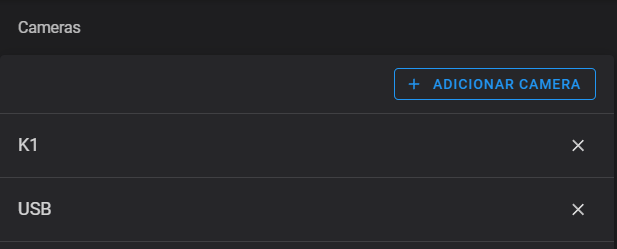
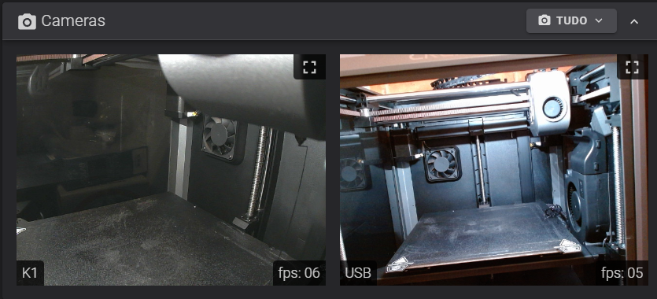

# Creality K1 - USB Camera from front USB Port / Dual Camera K1 + USB
(Creality K1 - Webcam utilizando a USB frontal / Duas cameras K1 + USB)

## Follow this steps to Install
(Siga estes passos para instalação)

SSH access to your printer and run:
(Acesse sua impressora via SSH e execute este comando:)
```sh
(cd ~ && git clone https://github.com/trevos3d/K1-USB-Cam.git && cd K1-USB-Cam && chmod +x *.sh && ./install.sh)
```

Chose Single or dual Camera installation.
(Escolha entre instalar apenas a camera USB ou as duas cameras (K1 + USB Camera)

Caso a webcam não apareça automaticamente no Fluidd, reinicie a impressora.

## Uninstall (It will clean all USB Camera files)
(Para desinstalar - Isso vai remover todos os arquivos relativos a esta instalação)

```sh
(cd ~/K1-USB-Cam && git pull && ./uninstall.sh)
```

## Update (when available)
(Para atualizar, caso haja uma atualização disponivel)

```sh
(cd ~/K1-USB-Cam && git pull && ./install.sh)
```
Chose Single or dual Camera installation.
(Escolha entre instalar apenas a camera USB ou as duas cameras (K1 + USB Camera)


## To get camera access
(Acessando a camera)

Access the url for the cameras:
(Acesse a url abaixo alterando o endereço pro IP da sua impressora.)

1st camera:
- USB camera stream: http://your-printer-IP:8080/?action=stream
- USB camera snapshot: http://your-printer-IP:8080/?action=snapshot

2nd camera:
- USB camera stream: http://your-printer-IP:8080/?action=stream_1
- USB camera snapshot: http://your-printer-IP:8080/?action=snapshot_1

Please remember to change *your-printer-IP* on url above.
(Não esqueça de alterar o *your-printer-IP* para o endereço IP da sua camera)


## Considerations
- To show both cameras you need to change the second camera Url when add camera or the image will be duplicated.
(Para exibir ambas as cameras você precisa alterar o Camera Url ao adicionar a segunda camera ou a imagem ficará duplicada.)




When finish, you will can see something like this on your dashboard.
(Quando terminado, você verá algo parecido com isso no seu dashboard.)


